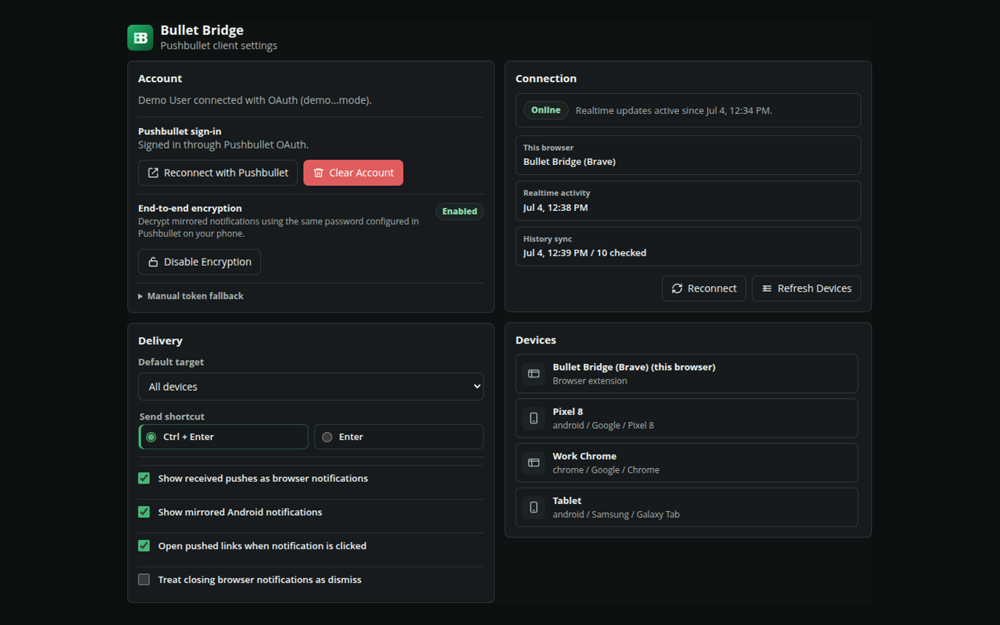
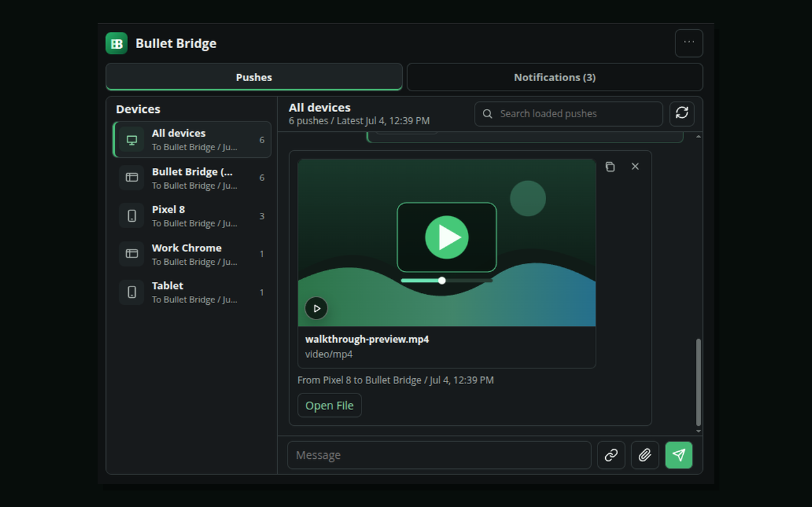
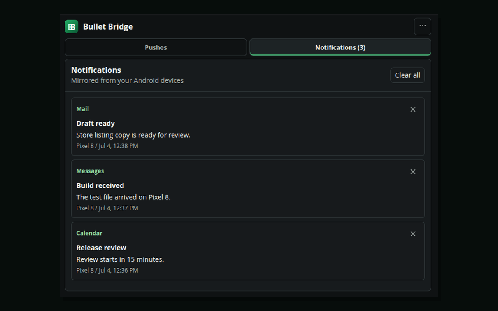
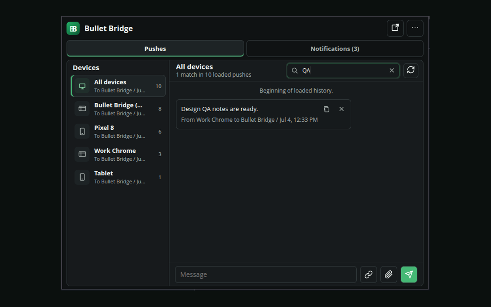
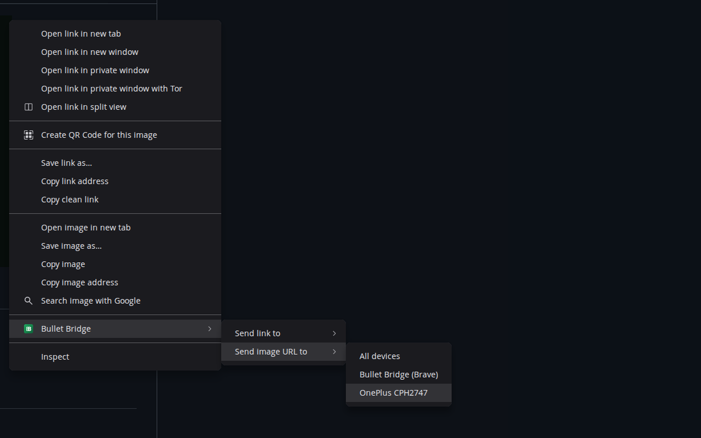

# Bullet Bridge

Independent Manifest V3 browser extension for Pushbullet users.

Bullet Bridge is built for Brave and Chrome-compatible browsers after the old Pushbullet extension stopped working. It can connect through the bundled Bullet Bridge Pushbullet OAuth client or a personal Pushbullet access token stored in extension-local browser storage.

Bullet Bridge is an independent, unofficial client for Pushbullet users. It is not affiliated with, endorsed by, sponsored by, or provided by Pushbullet.

This repository is source-available for transparency and user trust. It is not open source in the OSI sense, and the license does not allow republishing modified copies or submitting derivative browser extensions to extension stores without permission.

GitHub-only builds use a fixed extension ID for unpacked installs:

```text
ibhimmdnfbnhjdidoofgmlmngjdbneal
```

## Current Features

- Sign in with Pushbullet OAuth by using a configured OAuth client ID.
- Save and test a Pushbullet access token as a manual fallback.
- Register this browser as a Pushbullet device with a browser-specific name, such as `Bullet Bridge (Brave)`.
- Send notes, links, current-tab links, and files.
- Send to all devices or a selected device.
- Browse recent push history in a chat-style popup.
- Load older pushes on demand.
- Search the loaded push history by message, URL, file, and device text.
- Preview image, video, file, and link pushes in the chat history.
- Copy exact push content from chat bubbles.
- Delete individual pushes from chat history.
- Push pages, links, selected text, and image URLs from the right-click context menu.
- Choose the target device directly from the right-click context menu.
- Receive Pushbullet websocket events.
- Show received pushes as browser notifications.
- Show mirrored Android notifications in the popup and as browser notifications.
- Open or dismiss pushes from browser notification action buttons.
- Dismiss mirrored Android notifications from browser notification action buttons.
- Clear individual mirrored notifications or clear all local mirrored notifications.
- Open pushed links from browser notifications.

## Screenshots











## Not Included

- SMS.
- Chrome Web Store packaging.

## Hosted Privacy Policy

The extension store privacy policy page is:

https://bulletbridge.github.io/bullet-bridge/privacy.html

## Install From GitHub

1. Download and extract this repository, or clone it:

   ```bash
   git clone https://github.com/bulletbridge/bullet-bridge.git
   ```

2. Open `brave://extensions` or `chrome://extensions`.
3. Enable `Developer mode`.
4. Click `Load unpacked`.
5. Select the extracted or cloned `bullet-bridge` folder that contains `manifest.json`.
6. Open Bullet Bridge and click `Sign In`.
7. Approve Bullet Bridge on the Pushbullet authorization page.

After updating an already-loaded copy, reload the extension on `brave://extensions`. If device state looks stale, click `Refresh Devices` in options.

Get a personal Pushbullet access token from:

https://www.pushbullet.com/#settings/account

## Maintainer OAuth Configuration

The GitHub-only build includes the Bullet Bridge Pushbullet OAuth client ID. Users do not need to create their own OAuth client.

The bundled Pushbullet OAuth client must use this redirect URI:

```text
https://ibhimmdnfbnhjdidoofgmlmngjdbneal.chromiumapp.org/pushbullet
```

Leave `allowed_origin` blank if Pushbullet accepts it. If Pushbullet requires a value, use:

```text
chrome-extension://ibhimmdnfbnhjdidoofgmlmngjdbneal
```

The redirect URI depends on the installed extension ID. This GitHub-only build pins the unpacked extension ID with `manifest.key`. A future Chrome Web Store release must use the stable ID assigned to that store item and a matching OAuth client.

Keep the Pushbullet OAuth client display identity aligned with Bullet Bridge:

- Name: `Bullet Bridge`
- Website URL: `https://github.com/bulletbridge/bullet-bridge` or the future project site.
- Image URL: a public HTTPS URL for `icons/icon-128.png`.

The image URL must be reachable without authentication. A private GitHub raw URL will not render inside Pushbullet clients.

## Development

Run local checks:

```bash
npm run check
```

Build a GitHub release zip:

```bash
npm run build
```

The build output is written to `dist/bullet-bridge-<version>.zip`.

## Screenshot Demo Mode

Use demo mode when capturing public screenshots so real names, devices, pushes, and notifications are not shown.

Enable demo mode:

```text
chrome-extension://ibhimmdnfbnhjdidoofgmlmngjdbneal/src/options.html?demo=1
```

Disable demo mode:

```text
chrome-extension://ibhimmdnfbnhjdidoofgmlmngjdbneal/src/options.html?demo=0
```

After enabling or disabling it, reload the popup/options page. Demo mode only changes local display data in the extension UI; it does not send real pushes or upload files.

The committed screenshots in `docs/screenshots/` are captured from demo mode at `1280x800`.

The extension is dependency-free at runtime. It uses vanilla JavaScript modules, Chrome extension APIs, Pushbullet HTTP APIs, and Pushbullet websocket events.

## License

Bullet Bridge is source-available under the [Bullet Bridge Source Available License](LICENSE).

You may inspect the source, audit privacy-sensitive behavior, and install official Bullet Bridge releases. You may not redistribute modified versions, publish derivative browser extensions, or use Bullet Bridge branding without permission.

See [TRADEMARK.md](TRADEMARK.md) for Bullet Bridge branding and Pushbullet compatibility wording.

## Release Status

Version `0.4.0` is a GitHub-only build that is usable for daily testing.

Current distribution target is GitHub-only. Before any Chrome Web Store release, the project should complete a full Chrome Web Store policy review and trusted-tester install test.

## Disclaimer

Bullet Bridge is an unofficial client for Pushbullet. It is not affiliated with, endorsed by, sponsored by, or provided by Pushbullet.

Pushbullet is a trademark of its respective owner. The Pushbullet name is used only to describe compatibility with the Pushbullet service.
